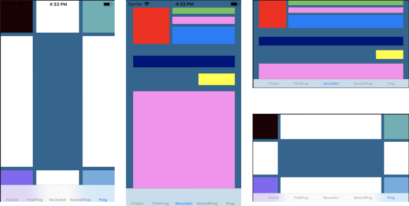

# Autolayout example





## NSLayoutConstraint programmatically  

### Top right

```
        let black = UIView()
        black.backgroundColor = UIColor(hexValue: "#1D0204", alpha: 1)
        view.addSubview(black)
        black.translatesAutoresizingMaskIntoConstraints = false
        let hcBlack = black.topAnchor.constraint(equalTo: view.topAnchor)
        let vcBlack = black.topAnchor.constraint(equalTo: view.topAnchor)
        let widthBlack = black.widthAnchor.constraint(equalToConstant: 90)
        let heightBlack = black.heightAnchor.constraint(equalToConstant: 90)
        NSLayoutConstraint.activate([hcBlack, vcBlack, widthBlack, heightBlack])
```

### Top left

```
        let greenSemi = UIView()
        greenSemi.backgroundColor = UIColor(hexValue: "#5DB1B5", alpha: 1)
        view.addSubview(greenSemi)
        greenSemi.translatesAutoresizingMaskIntoConstraints = false
        let hcGreenSemi = greenSemi.trailingAnchor.constraint(equalTo: view.trailingAnchor)
        let vcGreenSemi = greenSemi.topAnchor.constraint(equalTo: view.topAnchor)
        let widthGreenSemi = greenSemi.widthAnchor.constraint(equalToConstant: 90)
        let heightGreenSemi = greenSemi.heightAnchor.constraint(equalToConstant: 90)
        NSLayoutConstraint.activate([hcGreenSemi, vcGreenSemi, widthGreenSemi, heightGreenSemi])
        
```
### Top between left and right
```
let topWhite = UIView()
        topWhite.backgroundColor = UIColor.white
        view.addSubview(topWhite)
        topWhite.translatesAutoresizingMaskIntoConstraints = false
        let hcTopWhite = topWhite.topAnchor.constraint(equalTo: view.topAnchor)
        let vcTrailingTopWhite = topWhite.trailingAnchor.constraint(equalTo: view.trailingAnchor, constant: -100)
        let vcLeadingTopWhite = topWhite.leadingAnchor.constraint(equalTo: view.leadingAnchor, constant: 100)
        let heightTopWhite = topWhite.heightAnchor.constraint(equalToConstant: 90)
        NSLayoutConstraint.activate([hcTopWhite, vcTrailingTopWhite, vcLeadingTopWhite, heightTopWhite])
```


## Extension

```
extension UIColor {
    convenience init? (hexValue: String, alpha: CGFloat) {
        if hexValue.hasPrefix("#") {
            let scanner = Scanner(string: hexValue)
            scanner.scanLocation = 1
            
            var hexInt32: UInt32 = 0
            if hexValue.count == 7 {
                if scanner.scanHexInt32(&hexInt32) {
                    let red = CGFloat((hexInt32 & 0xFF0000) >> 16) / 255
                    let green = CGFloat((hexInt32 & 0x00FF00) >> 8) / 255
                    let blue = CGFloat(hexInt32 & 0x0000FF) / 255
                    self.init(red: red, green: green, blue: blue, alpha: alpha)
                    return
                }
            }
        }
        return nil
    }
}
```

